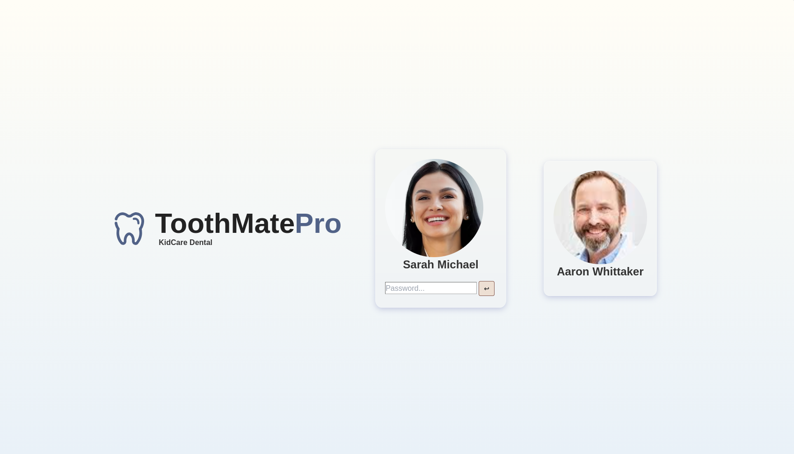
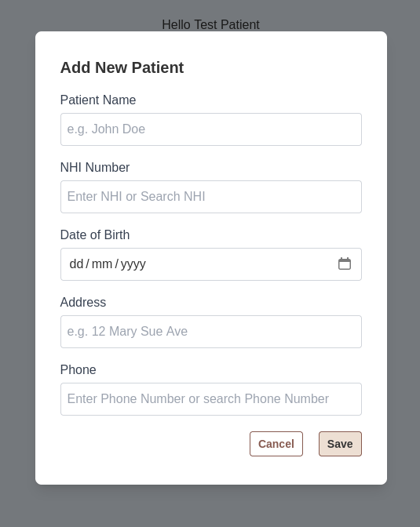
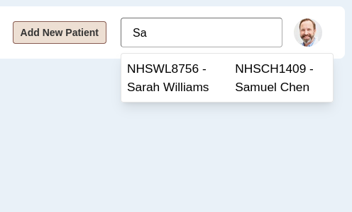
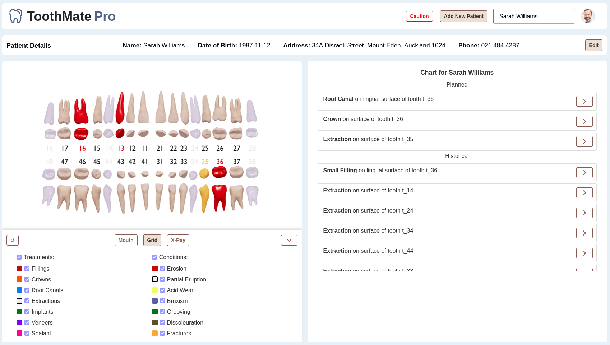
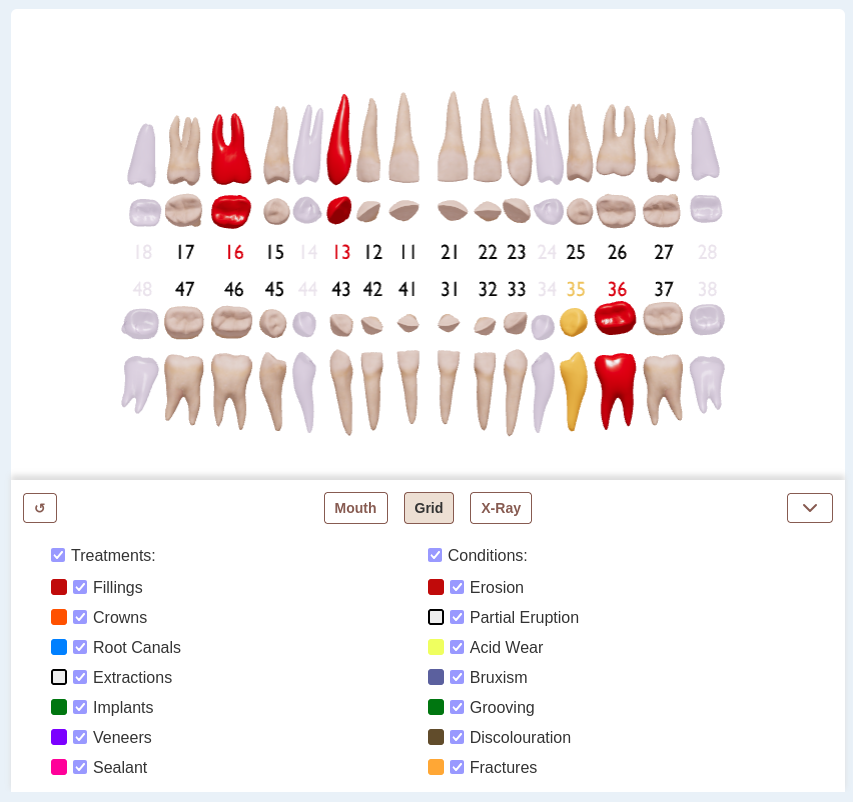
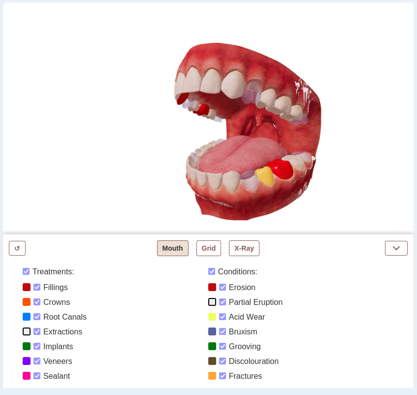
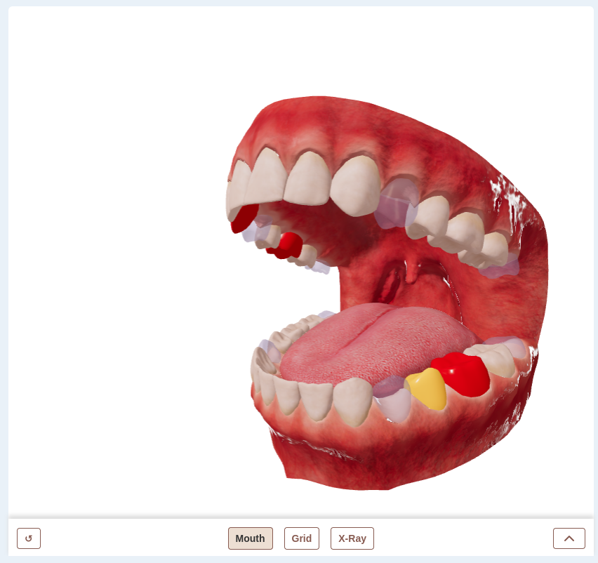
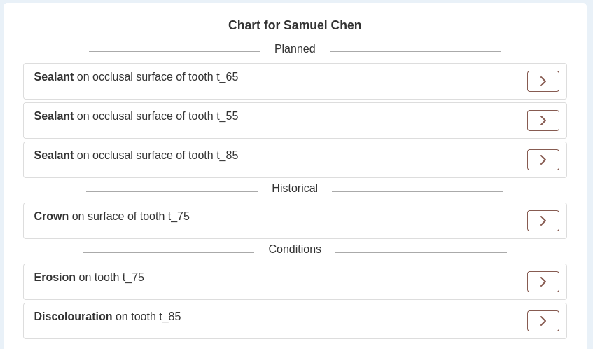
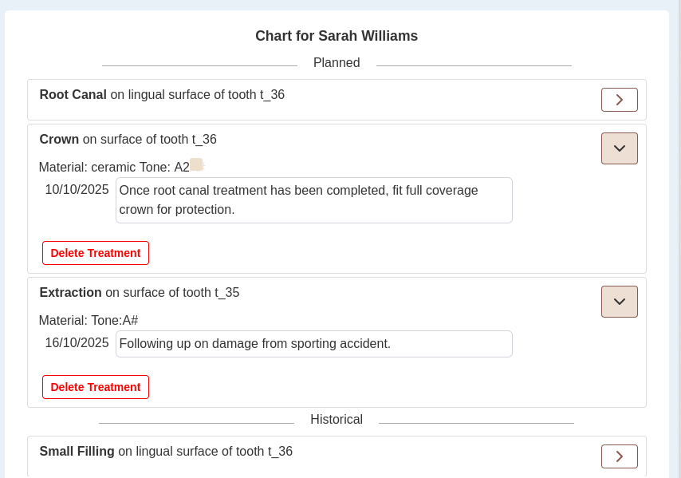
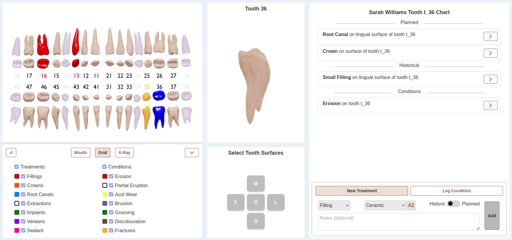

# Toothmate Pro Charting Application

Toothmate Pro is a prototype dental clinic management application intended as a companion to the Toothmate App mobile application for patients.

## Team
The 2025 Toothmate Pro repository is a combination of code from previous teams and our team.

New code for 2025 was written by Skye Pooley and Caleb Buckley with assistance from Matthew Warn, Sam Hurd, Duane Belleza, and Adrian Chand.

The team was mentored by Jim Buchan and moderated by Tony Clear.

Alana Payne is the client for the project and owner of the Toothmate brand.

## Functionality and Workflows
This web application is focused on the charting aspect of the proposed Toothmate pro application. A Figma prototype with expanded clinic management capabilities is available here [Figma Prototype](https://www.figma.com/proto/wQIy50lYzD246DqJH6MLMA/Toothmate-Pro-Designs?node-id=39-2&t=UjPOWPuUNaQ2tvhk-1).

### Login Page

The login page is intended to be clinic-specific in the production software. Currently the dentist profiles are only for demonstration and both lead to the same chart editing interface. To enter, click on either dentist and enter the password.  

Simple password protection was implemented both to demonstrate how the production app would work and to protect Alana's intellectual property as the prototype is available over the internet.


### Loading and Adding Patients
Once you have logged in, you can either add a new patient using the "Add Patient" button and menu or use one of the pre-made demonstration patients. The pre-made patients match those present in the Figma prototype and in the patient App.
#### New Patient Menu


#### Patient Search Menu
  
To load one of the pre-made patients, begin typing their name into the search box and then click one of the displayed options.

### Chart
When you select a patient you will be presented with their chart.  

On the top is the patients basic details and the option to update them.  

### Grid Chart Viewer
On the left is the interactive chart which allows you to view all the patien's teeth in either a grid view (default) or a 3D mouth view. This 3D mouth view is intended to be replaced with 3D scans from patient's mouths in the production app.

  
The teeth in the chart viewer are coloured according to the treatments and conditions which have been logged for each of them. Below the chart is a menu displaying a key of colour meanings and options for the view.  

As we can only show one colour per tooth, the most recent treatment is shown first. If display of that treatment type is disabled using the tick-boxes in the options menu then any earlier treatments of different types will be shown instead.  

The "↺" button on the left is used to reset pan, tilt, and zoom on the chart viewer.

### 3D Mouth Chart Viewer
If you click the "Mouth" button below the chart then the chart will switch to a 3D view displaying the same information as the grid view. You can switch between these two views at any time.  

  
You can rotate the mouth to view different areas by clicking and dragging anywhere on the chart viewer panel.  
Scroll up and down on the scroll wheel to zoom in and out.


  
Click the down arrow on the chart options panel to temporarily hide it and display the chart full screen.


### Treatment and Condition List
On the right hand side of the screen you will see a list of the patients history. This lists all the conditions and treatments for the patient both historical and planned.



Click on the arrow icon on any treatment or condition to see its details and optionally delete it.


### Treatment Editor
If you click any tooth in the chart viewer on the left, the patient history list on the right will update to show only treatments on that tooth. the selected tooth will be shown in bright blue.  
Additionally, the menu to add new treatments and conditions will be enabled along with the single tooth viewer and the tooth surface selector.



To de-select the tooth and go back to the patient's entire history, simply click on the tooth again.

You can navigate between teeth either by clicking on them or by using the arrow keys on your keyboard.

To add a new treatment, use the menu in the bottom right to select the procedure, fill in its options, and enter notes.  
Some procedures will require you to select tooth surfaces on the "Select Tooth Surfaces" panel. If this is not required, then the panel is not shown.

Treatments already completed can be added as historical during patient intake. Planned treatments should be assigned an apointment date and time.

After you click the "Add" button, the treatment will be sent to the database and appear on screen once it is saved.

## Technical Requirements
The following sections are intended as reference for any incoming future teams.

### Components
The application has three components:
- Front-end web application written in React
- Back end Express JS API running on NodeJs
- MySQL Database

The development build of the Client and API has been dockerised and can be run simply by navigating to the top level folder of the repository and running ```docker compose up```.

The database must be manually installed on a server and tables initialised by editing the API database_init.js script to alter tables and starting the API.

### Deployment
All three components have been deployed to a DigitalOcean Droplet cloud server. Alana Payne should have access to the dashboard for managing the instance.

SSH, SCP, and SFTP access are enabled on the reserved public IP ```170.64.242.49```

The client web server has been deployed to NGINX and is running with https on port 443 with /api/* requests bein proxied to the API which is running on port 5000.

SSL certificates for HTTPS should automatically renew when they expire early next year.

The URL https://toothmate.co.nz is pointed to the DigitalOcean server's public IP address. The domain was registered through https://www.domain.co.nz/, Alana holds the account and should provide you with login information if needed.

The MySQL server has also been deployed to the server and runs on port 3306.